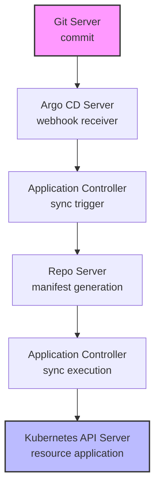
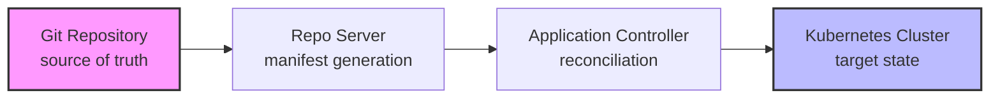

# GitOps Process: End-to-End Flow

This document explains what happens when a developer pushes a commit to a Git repository that Argo CD is watching, and how the different components interact to automatically sync changes to the Kubernetes cluster.

## Overview

When you push a commit to a Git repository that Argo CD is monitoring, several components work together to automatically deploy your changes to the Kubernetes cluster. This is GitOps - treating Git as the single source of truth for your infrastructure and applications.

## Architecture Components

### 1. Git Server (GitHub/GitLab/etc.)
- Role: Source of truth for application manifests
- Responsibility: Stores Kubernetes YAML files, Helm charts, Kustomize overlays
- Trigger: Receives commits and provides webhook notifications

### 2. Argo CD Server (argocd-server)
- Role: API server and webhook receiver
- Responsibility: 
  - Receives webhook notifications from Git server
  - Provides REST API for Argo CD operations
  - Manages authentication and authorization
  - Serves the Argo CD UI

### 3. Application Controller (argocd-application-controller)
- Role: Core orchestrator and state manager
- Responsibility:
  - Monitors Git repositories for changes
  - Compares desired state (Git) with actual state (cluster)
  - Orchestrates the sync process
  - Manages application lifecycle

### 4. Repo Server (argocd-repo-server)
- Role: Git repository processor and manifest generator
- Responsibility:
  - Clones Git repositories
  - Processes Helm charts, Kustomize, and plain YAML
  - Generates Kubernetes manifests
  - Handles custom tools (like our Helm 3.12.3 override)

### 5. Kubernetes API Server
- Role: Cluster state manager
- Responsibility:
  - Receives and applies Kubernetes manifests
  - Manages cluster resources
  - Provides cluster state information

## End-to-End Process Flow

### Step 1: Git Commit & Webhook
Developer pushes changes to Git repository
Git server triggers webhook to notify Argo CD server
Argo CD server validates webhook and identifies affected applications

### Step 2: Manifest Generation
Application controller requests manifest generation from repo server
Repo server clones/updates Git repository and processes sources:
  - Plain YAML: Directly reads Kubernetes manifests
  - Helm Charts: Renders templates with values (using our Helm 3.12.3)
  - Kustomize: Applies overlays and patches
Repo server returns generated Kubernetes manifests

### Step 3: Sync Execution
Application controller compares manifests with current cluster state
Controller creates and validates sync plan (create, update, delete operations)
Controller sends manifests to Kubernetes API server
API server validates and applies changes to cluster
Controller updates application status and sync history

## Component Interactions

### Webhook Flow


### Data Flow


## Example: This Setup

In this specific setup, here's what happens when you push changes:

### 1. Push to GitHub Repository
```bash
git add .
git commit -m "Update Prometheus configuration"
git push origin main
```

### 2. Argo CD Detects Change
- Root App (root-app) watches the gitops/ directory
- Argo CD App (argocd) watches the gitops/apps/argocd/ directory
- Prometheus App (kube-prometheus-stack) watches the gitops/apps/monitoring/ directory

### 3. Sync Process
1. Repo Server processes our Helm charts and Kustomize overlays
2. Application Controller compares desired vs actual state
3. Kubernetes API Server applies the changes
4. Monitoring is updated with new configurations

### 4. Result
- New Prometheus rules are applied
- ServiceMonitors are updated
- Grafana dashboards are refreshed
- All changes are reflected in the cluster


## Monitoring the Process

### Argo CD UI
- Applications: View sync status and health
- Events: See sync history and errors
- Logs: Access component logs

### Command Line
Check application status:
```bash
kubectl get applications -n argocd
```

View sync status:
```bash
kubectl describe application <app-name> -n argocd
```

Check component logs:
```bash
kubectl logs -n argocd deployment/argocd-application-controller
kubectl logs -n argocd deployment/argocd-repo-server
```

### Debug Commands
Check webhook delivery:
```bash
kubectl logs -n argocd deployment/argocd-server
```

Check repo server processing:
```bash
kubectl logs -n argocd deployment/argocd-repo-server
```

Check application controller:
```bash
kubectl logs -n argocd deployment/argocd-application-controller
```

Check sync status:
```bash
kubectl get applications -n argocd -o yaml
```

This GitOps process ensures that your Kubernetes cluster always matches the state defined in your Git repository, providing a reliable, auditable, and automated deployment pipeline.

## References

- [Argo CD Architectural Overview](https://argo-cd.readthedocs.io/en/stable/operator-manual/architecture/)
- [Akuity Academy](https://academy.akuity.io/courses/gitops-argocd-intro)
