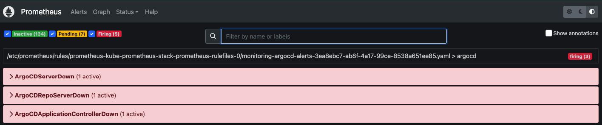
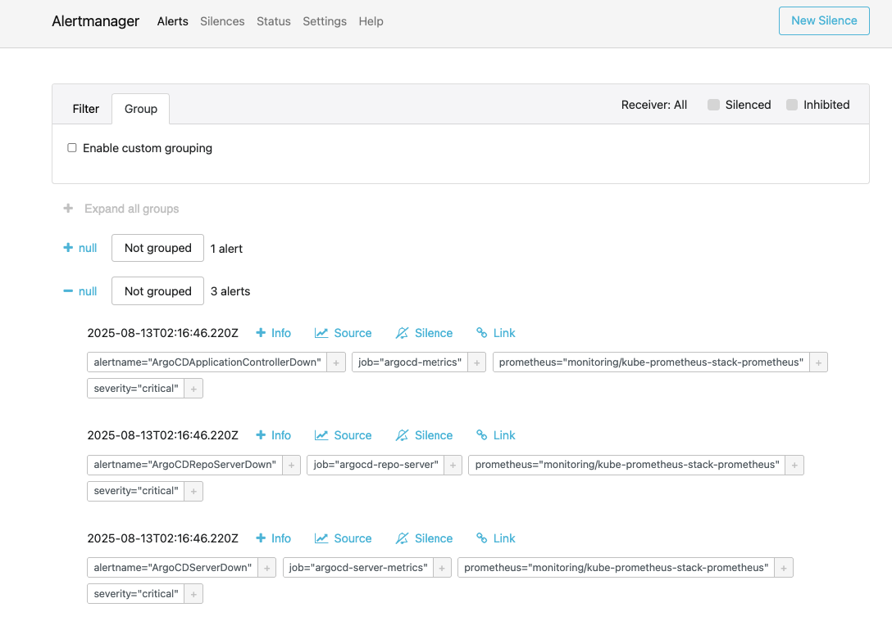
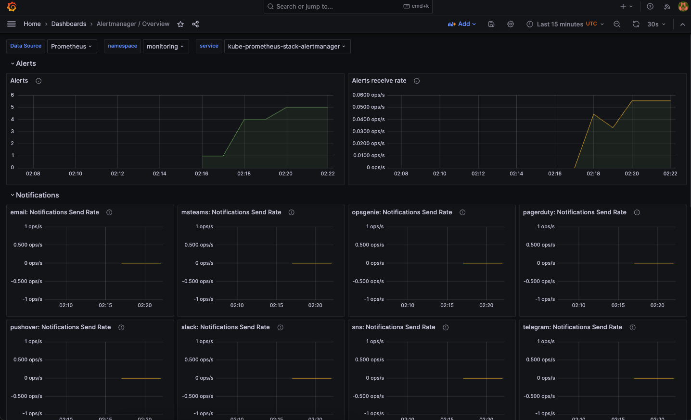
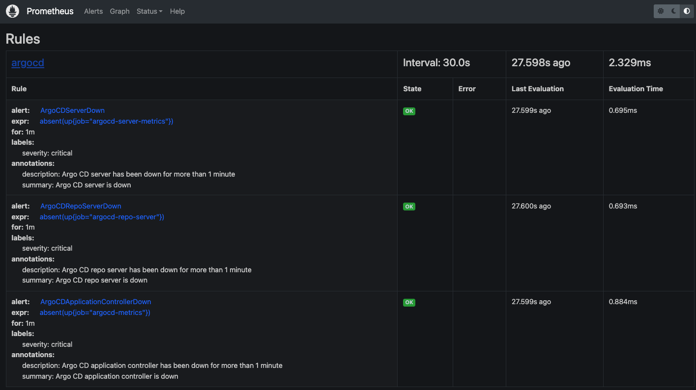

# Kind Argo CD GitOps Setup

A GitOps setup using Argo CD with Kind cluster, featuring self-management, custom Helm version override, and monitoring.

## Requirements Met

This setup fulfills all three core requirements:

1. **Argo CD Self-Management**: Argo CD manages its own configurations and lifecycle
2. **Prometheus Monitoring**: Complete monitoring stack with dashboards and alerts for Argo CD
3. **Custom Helm Version**: Replaces the default Helm binary with Helm 3.12.3

## Quick Start

### Prerequisites

- [Kind](https://kind.sigs.k8s.io/docs/user/quick-start/)
- [kubectl](https://kubernetes.io/docs/tasks/tools/)
- [Git](https://git-scm.com/)

### Setup

```bash
# Clone the repository
git clone <your-repo-url>
cd kind-argosy

# Run the setup script
./scripts/setup-gitops.sh
```

## Project Structure

```
kind-argosy/
├── cluster-setup/
│   ├── kind-config.yaml          # Kind cluster configuration
├── gitops/
│   ├── kustomization.yaml        # Kustomize configuration
│   └── apps/
│       ├── root-app.yaml         # Root application (bootstrap)
│       ├── argocd/
│       │   └── argocd-app.yaml   # Argo CD application with custom Helm
│       └── monitoring/
│           ├── prometheus-app.yaml    # Prometheus stack
│           ├── argocd-servicemonitor.yaml # Service monitors
│           └── argocd-alerts.yaml     # Alert rules
└── scripts/
    └── setup-gitops.sh           # Complete setup script
```

## Key Features

### 1. Argo CD Self-Management

The `root-app.yaml` creates a bootstrap application that manages all other applications through GitOps.

### 2. Custom Helm Version (3.12.3)

Uses the official Argo CD custom tooling approach to override the Helm binary:

```yaml
repoServer:
  volumes:
    - name: custom-tools
      emptyDir: {}
  
  initContainers:
    - name: download-helm
      image: alpine:3.18
      command: [sh, -c]
      args:
        - wget -qO- https://get.helm.sh/helm-v3.12.3-linux-amd64.tar.gz | tar -xvzf - &&
          mv linux-amd64/helm /custom-tools/ &&
          chmod +x /custom-tools/helm
      volumeMounts:
        - name: custom-tools
          mountPath: /custom-tools
  
  volumeMounts:
    - name: custom-tools
      mountPath: /usr/local/bin/helm
      subPath: helm
```

### 3. Monitoring Stack

- **Prometheus**: Metrics collection with NodePort access (port 30000)
- **Grafana**: Dashboards with NodePort access (port 31000, admin/admin123)
- **AlertManager**: Alert notifications with NodePort access (port 32000)
- **ServiceMonitors**: Automatic Argo CD metrics collection
- **AlertRules**: Comprehensive Argo CD health monitoring

## Monitoring Examples

### Prometheus Alerts

The monitoring stack includes comprehensive alerts for Argo CD components:



*Prometheus alerts interface showing Argo CD component health status*

### AlertManager Notifications

AlertManager provides centralized alert management and notification routing:



*AlertManager interface displaying critical Argo CD alerts with severity levels*

### Grafana Dashboards

Grafana provides detailed monitoring dashboards for AlertManager metrics:



*Grafana dashboard showing AlertManager alert counts and notification rates*

### Prometheus Rules

Prometheus rules are configured to monitor Argo CD component health:



*Prometheus rules interface showing configured Argo CD alert rules and their status*

## Access

### Access Services

After running the setup script, all services are automatically accessible:

- **Argo CD UI**: https://localhost:8080 (admin/[password from setup])
- **Prometheus**: http://localhost:30000
- **Grafana**: http://localhost:31000 (admin/admin123)
- **AlertManager**: http://localhost:32000

The setup script automatically waits for GitOps sync to complete and starts port forwarding for all services.

## Verification

```bash
# Check Argo CD status
kubectl get pods -n argocd

# Check applications
kubectl get applications -n argocd

# Verify Helm version
kubectl exec -n argocd deployment/argocd-repo-server -- helm version

# Check monitoring
kubectl get pods -n monitoring
```

## Customization

### Adding Applications
1. Create application YAML in `gitops/apps/`
2. Add to `gitops/kustomization.yaml`
3. Commit and push to Git

### Changing Helm Version
Edit `gitops/apps/argocd/argocd-app.yaml` and update the Helm version in the `initContainers` section.

## Troubleshooting

### Common Issues

1. **Argo CD not syncing**
   ```bash
   kubectl describe application root-app -n argocd
   ```

2. **Custom Helm not working**
   ```bash
   kubectl logs -n argocd deployment/argocd-repo-server -c download-helm
   ```

3. **Monitoring not accessible**
   ```bash
   kubectl get svc -n monitoring
   ```

## References

- [Argo CD Documentation](https://argo-cd.readthedocs.io/)
- [Argo CD Custom Tooling](https://argo-cd.readthedocs.io/en/latest/operator-manual/custom_tools/)
- [Prometheus Operator](https://prometheus-operator.dev/)
- [Kind Documentation](https://kind.sigs.k8s.io/)
